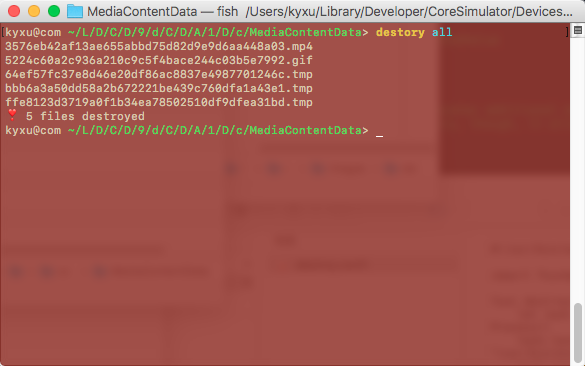
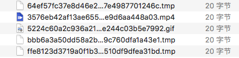

# English Introduction
**This a command line tool written by Swift to test how does application deal with damaged resource files.**
### How to Use
Assuming that you have placed <code>destroy.swift</code> at <code>/Users/kyxu/Dev/destroy.swift</code>, your resource folder path is <code>/Users/kyxu/desktop/res</code>, and you want to damage the gif and mp4 files in the folder:
<pre><code>cd /Users/kyxu/desktop/res
alias destroy="/Users/kyxu/Dev/destroy.swift"
destroy gif mp4
</code></pre>
If you want to corrupt all files in the folder, execute:
<pre><code>destroy all
</code></pre>
Without parameters, directly execute <code>destroy</code> will not damage any file
### Destroy Logic
The script would creates one or more files (size 20B) on the specified path for replacing the qualified source files (.gif .mp4, etc.)

----
# 中文介绍
**这是一个使用 Swift 编写的命令行工具，用于测试应用如何应对损坏的资源文件。**
### 如何使用
假设你已经将仓库中的 <code>destroy.swift</code> 放置在 <code>/Users/kyxu/Dev/destroy.swift</code>，你的资源文件夹路径是 <code>/Users/kyxu/desktop/res</code>，你希望损坏文件夹中的 gif 和 mp4 文件：
<pre><code>cd /Users/kyxu/desktop/res
alias destroy="/Users/kyxu/Dev/destroy.swift"
destroy gif mp4
</code></pre>
如果你希望损坏文件夹中的所有文件，可以执行：
<pre><code>destroy all
</code></pre>
不添加参数，直接执行 <code>destroy</code> 不会损坏任何文件
### 损坏逻辑
脚本会在指定路径创建一个或多个大小为 20B 的文件，用于替换符合条件的源文件（.gif .mp4 等）

